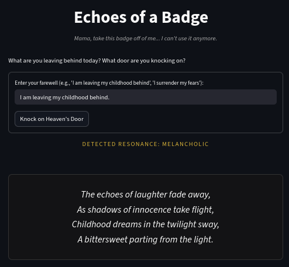
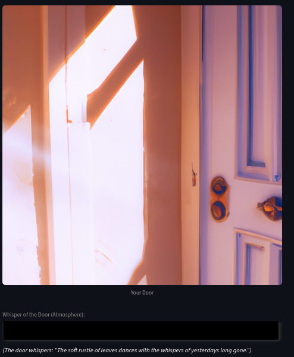

# Echoes of a Badge (The Doorway of 1973)

**CSE 358 Introduction to Artificial Intelligence - Creative Project**
**Project:** "Knock! Design Your Door"

This project is a web-based interactive digital artwork conceptualized around Bob Dylan's 1973 song "Knockin' on Heaven's Door". It allows the user to write down an emotional or physical "farewell" and, through a multi-modal pipeline of three AI models, visualizes and sonorizes their transition.

## Technical Architecture Overview
This project uses **Streamlit** as a fast and lightweight front-end mechanism. The pipeline organically integrates three distinct generative AI techniques relying on the OpenAI Python API:
1. **LLM Text Generation & Sentiment Analysis (`gpt-4o-mini` with JSON mode)**: Analyzes the user's farewell to extract the core emotion, generates a 4-line reflective response in the 1973 counterculture style, and crafts an ambient atmospheric description.
2. **Generative Audio / TTS (`tts-1`)**: Converts the generated text into two distinct auditory experiences (a world-weary poet reciting the stanza and the ambient whisper of the "door").
3. **Diffusion Image Generation (`dall-e-2`)**: Takes the extracted sentiment and the poem as its input prompt, outputting a melancholic visual representation of "The Door" the user is crossing.

## Installation & Setup
1. **Clone the repository** to your local environment.
2. Create and activate a Virtual Environment.
   ```bash
   python -m venv venv
   source venv/bin/activate  # On Windows use `venv\Scripts\activate`
   ```
3. Install dependencies from `requirements.txt`:
   ```bash
   pip install -r requirements.txt
   ```
4. Create a `.env` file in the root directory and place your OpenAI API key inside:
   ```env
   OPENAI_API_KEY="your-api-key-here"
   ```
5. Run the application:
   ```bash
   streamlit run app.py
   ```

## Example Outputs
Below are examples of the artwork generated by the system when a user knocks on the door:

### The Poem & Emotion Resonance


*Listen to the Voice of the Wanderer:*  
[▶️ Play poem.mp3](poem.mp3)

### The Visual Ambience & Doorway


*Listen to the Whisper of the Door:*  
[▶️ Play ambient.mp3](ambient.mp3)